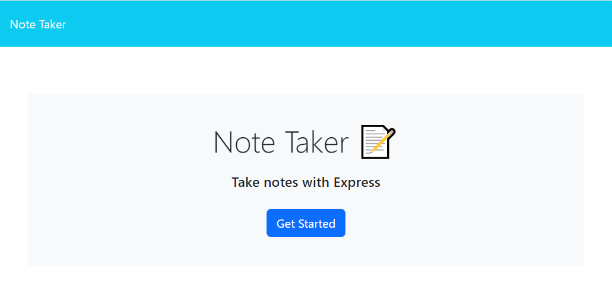

# ELL-Notes-Taker

## Description

I wanted to create this Notes app that would allow my users to easily keep track of some notes they made! I focused on using express and how to get information from a JSON file. 

## Installation

npm i

## Usagef

The [website](https://git.heroku.com/fierce-cove-12037.git) created allows you to use my notes app! 

Feel free to browse through my [repo](https://github.com/elizabeth189/ELL-Notes-Taker) 

## License

Please refer to the LICENSE in the repo.
